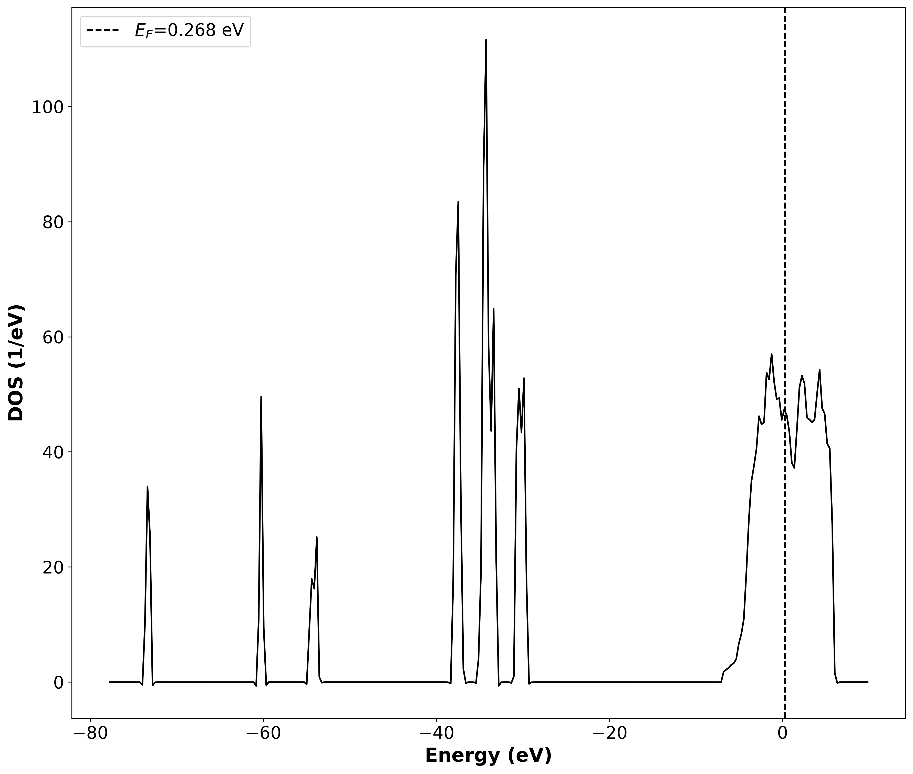
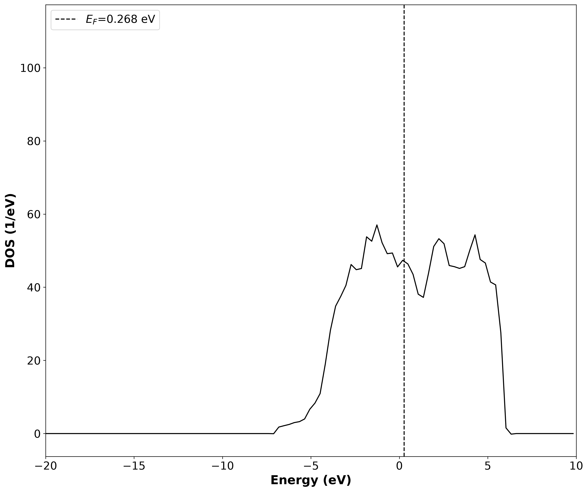
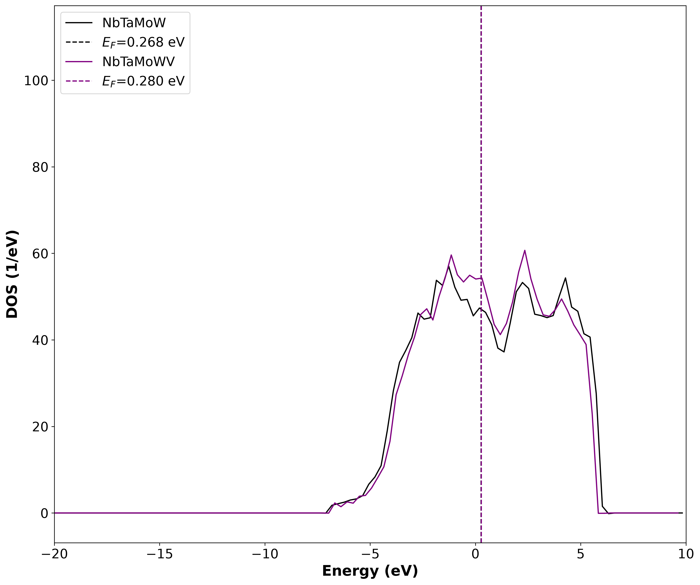
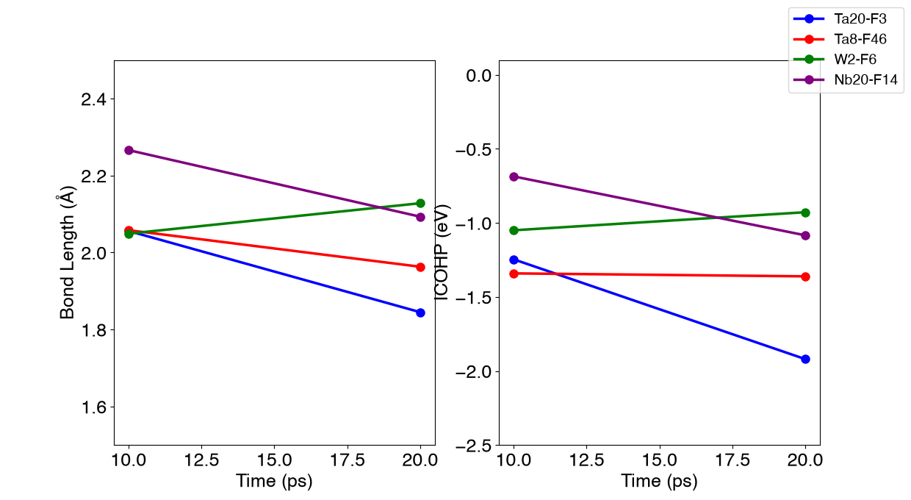
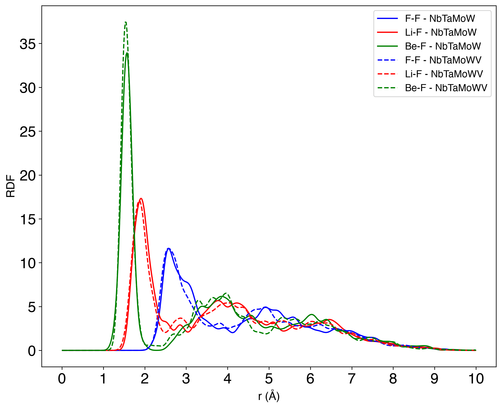
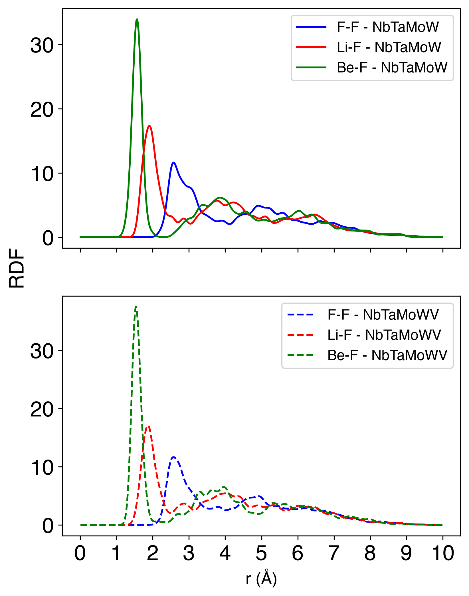
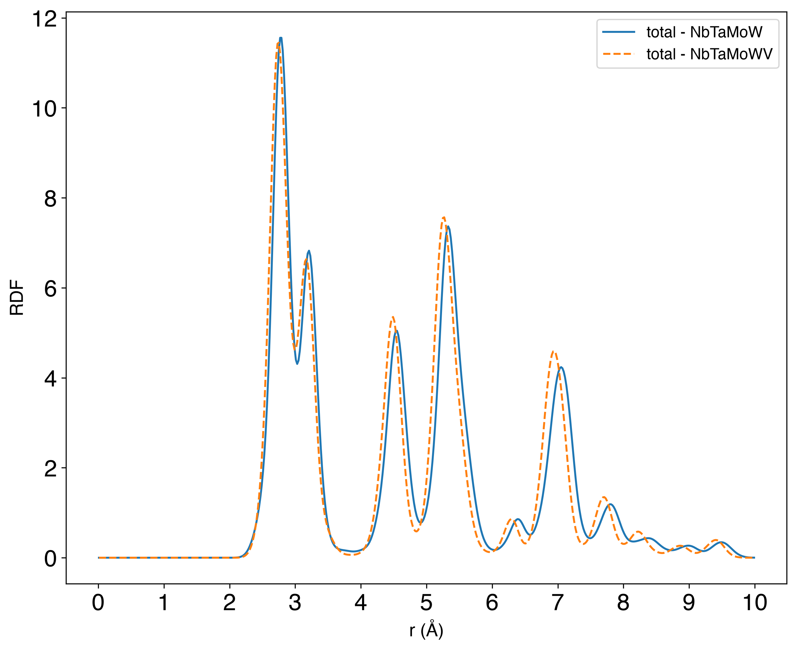

# pyvasptools

Provides Python scripts for analyzing the:

- **Radial distribution function (RDF)** — calculated directly from VASP structure files (`POSCAR`)
- **Density of states (DOS)** — calculated directly from VASP output files (`vaspout.h5`)
- **Crystal orbital Hamilton population analysis** — analyzed beforehand with LOBSTER
- **Electron localization function partitioning** — analyzed beforehand with critic2

## Installation

Requires Python ≥ 3.10.14.

1. Create a Python environment to isolate the package dependencies:

   ```bash
   python3 -m venv ~/envs/pyvasp_tools
   ```

2. Activate the Python environment:

   ```bash
   source ~/envs/pyvasp_tools/bin/activate
   ```

3. Install the package from PyPI:

   ```bash
   pip install pyvasptools
   ```

   Or install from a local clone (for development):

   ```bash
   cd /path/to/pyvasptools/
   pip install .
   ```

## Sample data

The example VASP outputs used by the tests and demos are too large for git and
are hosted on Zenodo: https://doi.org/10.5281/zenodo.22182966

Download the archive and unzip its contents into the repository root so that a
`sample_data/` folder sits next to this README:

```bash
cd /path/to/pyvasptools/
# download sample_data.zip from the Zenodo record above, then:
unzip sample_data.zip
```

## Example - Density of States calculated from ab initio molecular dynamics (AIMD) simulation VASP output files 

```python
from pathlib import Path

from pyvasptools.dataset import Dataset
from pyvasptools.dos.dos import plot_multi_overlaid_dos, plot_pdos_modified


current_dir = Path(__file__).parent
root_dir = current_dir.parents[1]


# Sample data set 1: Compare the total density of states of two (100)-NbTaMoW and (100)-NbTaMoWV slabs
# after 10 ps of ab initio molecular dynamics (AIMD) simulation at 800 K.  
NbTaMoW = Dataset(path=root_dir / 'sample_data/NbTaMoW/10ps/DOS', lc='black', label='NbTaMoW')
NbTaMoWV = Dataset(path=root_dir / 'sample_data/NbTaMoWV/10ps/DOS', lc='purple', label='NbTaMoWV')

# 1. Plot the total density of states of a single (100)-NbTaMoW alloy. 
NbTaMoW.plot_total_DOS(output_dir=current_dir, output_name='DOS_NbTaMoW')
# 2. Zoom in near the Fermi level (zoom_in=True) The DOS near the Fermi level is of significance due to its correlation with bonding and material properties.
NbTaMoW.plot_total_DOS(output_dir=current_dir, zoom_in=True, output_name='DOS_NbTaMoW_Fermi')

# 3. Compare the total density of states of two (100)-NbTaMoW and (100)-NbTaMoWV slabs. zoom_in=True zooms in close to the Fermi level. 
plot_multi_overlaid_dos(NbTaMoW, NbTaMoWV, zoom_in=True, output_dir=current_dir, output_name='DOS_NbTaMoW_vs_NbTaMoWV')

# 4. Now compare the partial density of states of the salt-alloy interface, specifically the interface between NbTaMoW and 2LiF-BeF2 and NbTaMoWV and 2LiF-BeF2. 
elements = ['Nb', 'Ta', 'Mo', 'W', 'F']

NbTaMoW = Dataset(path=root_dir / 'sample_data/NbTaMoW-FLiBe/10ps/DOS', lc="blue", ls="solid", label=f'')
NbTaMoWV = Dataset(path=root_dir / 'sample_data/NbTaMoWV-FLiBe/10ps/DOS', lc="purple", ls="solid", label=f'- V')

plot_pdos_modified(elements, {'d': 'solid', 'p': 'dashed', 's': 'dotted'}, NbTaMoW, NbTaMoWV, x_lim=(-10, 10), y_lim=(((-5, 100),) + ((-1, 20),) * 4 + ((-5, 50),)), labels=("", "- V"), path_to_fig=current_dir / 'pDOS_NbTaMoW_vs_NbTaMoWV')
```

The script above produces the following plots (see `tests/dos/`):

**1. Total DOS of a single NbTaMoW alloy**



**2. Same DOS, zoomed in near the Fermi level**



**3. Total DOS of NbTaMoW vs. NbTaMoWV**

The solid black and purple lines represent the total DOS of the NbTaMoW and NbTaMoWV alloys, respectively. The dotted black and purple lines represent the Fermi level of the NbTaMoW and NbTaMoWV alloys, respectively.



**4. Partial DOS of the NbTaMoW-FLiBe vs. NbTaMoWV-FLiBe interfaces**

The solid blue line represents the DOS of the (100)-NbTaMoW–FLiBe interface, while the solid purple line represents the DOS of the (100)-NbTaMoWV–FLiBe interface. The dotted blue and purple vertical lines represent the Fermi level of the NbTaMoW and NbTaMoWV alloy with the added salt, respectively.


## Example - Crystal Orbital Hamilton Population (COHP) analysis

```python
from pathlib import Path

from pyvasptools.cohp.COHP_run import COHP_plots, plot_bond_lengths
from pyvasptools.dataset import Bond


current_dir = Path(__file__).parent
root_dir = current_dir.parents[1]

# NbTaMoW-FLiBe COHP analysis
main_path = root_dir / 'sample_data/NbTaMoW-FLiBe'
times = [10, 20]
bonds = [Bond('Ta158', 'F45', 'blue'), Bond('Ta146', 'F88', 'red'), Bond('Nb138', 'F56', 'purple'), Bond('W160', 'F48', 'green')]

updated_bonds_list = COHP_plots(main_path, times, bonds, label=True, fig_path=current_dir / "NbTaMoW-FLiBe")
plot_bond_lengths(current_dir / "NbTaMoW-FLiBe", times, updated_bonds_list, file_name=current_dir / 'NbTaMoW-FLiBe')
```

The script above produces the following plots (see `tests/cohp/`):

**1. COHP of selected bonds at 10 ps**

.png>)

**2. COHP of selected bonds at 20 ps**

.png>)

**3. Bond lengths across simulation times**



## Example - Radial Distribution Function (RDF) analysis

```python
from pathlib import Path

from pyvasptools.dataset import Dataset, Bond
from pyvasptools.rdf.RDF import rdf


current_dir = Path(__file__).parent
root_dir = current_dir.parents[1]

# 1. Compare the radial distribution function of the NbTaMoW-FLiBe and NbTaMoWV-FLiBe interfaces
NbTaMoW_interface = Dataset(path=root_dir / 'sample_data/NbTaMoW-FLiBe/10ps/DOS', ls='-', label='NbTaMoW')
NbTaMoWV_interface = Dataset(path=root_dir / 'sample_data/NbTaMoWV-FLiBe/10ps/DOS', ls='--', label='NbTaMoWV')

# Selected bonds overlaid on a single plot
rdf([NbTaMoW_interface, NbTaMoWV_interface], Bond('F', 'F', 'blue'), Bond('Li', 'F', 'red'), Bond('Be', 'F', 'green'), fig_name=current_dir / 'RDF')
# Same bonds, one subplot per bond (same_plot=False)
rdf([NbTaMoW_interface, NbTaMoWV_interface], Bond('F', 'F', 'blue'), Bond('Li', 'F', 'red'), Bond('Be', 'F', 'green'), same_plot=False, fig_name=current_dir / 'RDF_separate_plots')

# 2. Total RDF of the metal surfaces in vacuum (total_RDF=True restricts to the listed elements)
NbTaMoW = Dataset(path=root_dir / 'sample_data/NbTaMoW/10ps/DOS', label='NbTaMoW')
NbTaMoWV = Dataset(path=root_dir / 'sample_data/NbTaMoWV/10ps/DOS', lc='red', label='NbTaMoWV')
rdf([NbTaMoW, NbTaMoWV], total_RDF=True, fig_name=current_dir / 'metal_surfaces_RDF', elements_to_plot=['Nb', 'Ta', 'Mo', 'W'])
```

The script above produces the following plots (see `tests/rdf/`):

**1. RDF of selected bonds, overlaid on a single plot**



**2. Same bonds, one subplot per bond**



**3. Total RDF of the bare metal surfaces**



